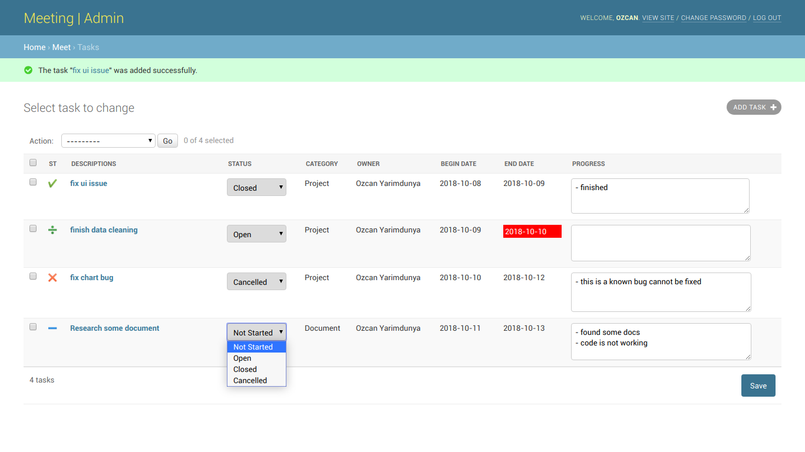

### Meeting | Admin

Small meeting plan app for small team

### Installation
```
docker-compose run -d --build
```

**NOTE:** To create a super user;
```
docker exec -ti meetings_web_1 bash
root@c35893d02286:/app# python manage.py createsuperuser
Username (leave blank to use 'root'): admin
Email address: admin@email.com
Password: 
Password (again): 
Superuser created successfully.
```

### Usage

Go to *http://<localhost or ip>:13001* in browser then enter super user credentials. 

**NOTE:** You need to create a super user and then for every user you need to give staff permission

### Screen shot

